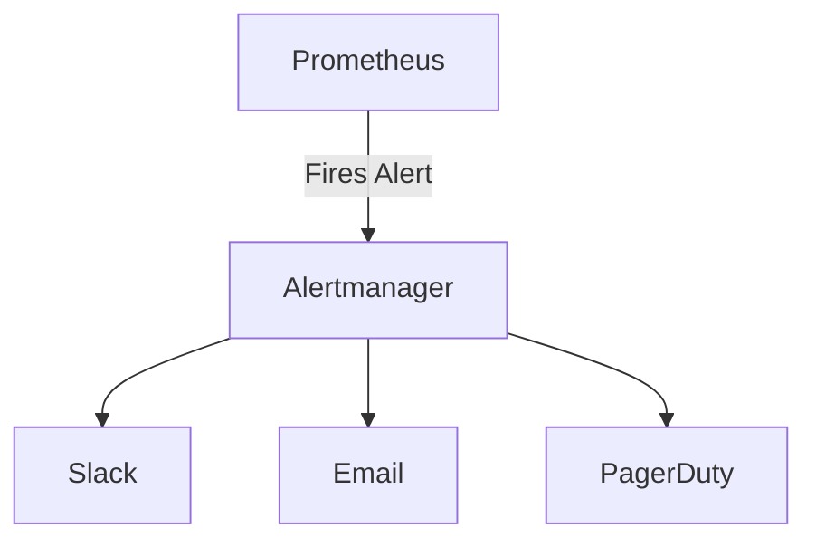
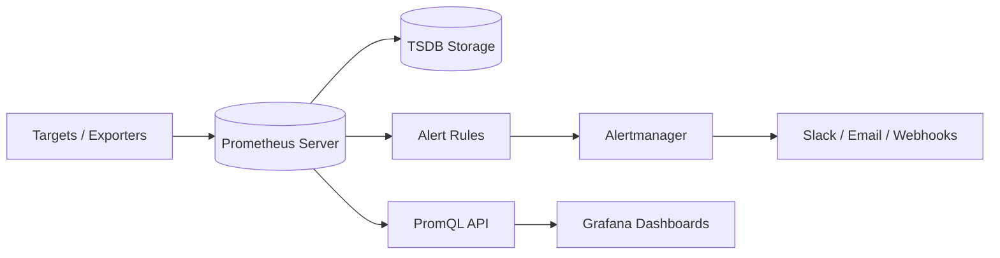

# 📊 Prometheus – Important Concepts (Cheat Sheet)

Prometheus is an open-source **metrics-based monitoring and alerting** system, ideal for microservices, Kubernetes, and cloud-native apps.

---

## 🚀 Why Prometheus?

| Feature | Description |
|--------|-------------|
| Data Model | Time-series metrics |
| Ideal For | Cloud-native & Kubernetes monitoring |
| Collection Method | Pull-based (Scrapes Targets) |
| Storage | Local TSDB storage |
| Alerting | Prometheus + Alertmanager |

---

<strong>📌 1. Core Components of Prometheus</strong>

| Component | Description |
|----------|--------------|
| **Prometheus Server** | Collects, stores, and processes metrics |
| **Node Exporter** | Exposes host-level metrics (CPU, RAM, Disk) |
| **Service Discovery** | Auto-detects targets (K8s, EC2, Consul, etc.) |
| **Alertmanager** | Sends alerts to Email, Slack, PagerDuty, etc. |
| **Pushgateway** | Allows push metrics from batch/cron jobs |
| **PromQL** | Query language to query and extract metrics |
| **TSDB** | Prometheus's local time-series database |

---

<strong>🧱 2. Prometheus Data Model</strong>

### ✅ Metric Types

| Metric Type | Meaning | Example |
|-------------|----------|----------|
| **Counter** | Always increases | Total HTTP requests |
| **Gauge** | Goes up & down | Memory / Temperature |
| **Histogram** | Sample observations in buckets | Request latency buckets |
| **Summary** | Quantile calculation (e.g., p90, p99) | Request duration quantiles |

> Most used in K8s: **Counter + Gauge + Histogram**

### 🔖 Time Series Format
<metric_name>{label1="value1", label2="value2"}

---

<strong>🧲 3. Pull Model & Service Discovery</strong>

### How Prometheus Scrapes Targets

- Default port: **9090**
- Prometheus **pulls** metrics from targets on `/metrics` endpoint
- Discovers services automatically for dynamic environments

| Environment | Auto Discovery Support |
|-------------|--------------------------|
| Kubernetes | ✅ Native |
| AWS EC2 | ✅ |
| Consul | ✅ |
| Docker | ✅ |
| Static Config | ✅ Manual |

---

<strong>📍 4. PromQL (Prometheus Query Language)</strong>

PromQL enables querying & mathematical operations on metrics.

| Example | Query | Description |
|----------|--------|----------------|
| Total Requests | `sum(http_requests_total)` | Total across services |
| Error Rate | `rate(http_requests_total{status!="200"}[5m])` | Errors per second |
| CPU Usage % | `100 - (avg by (instance) (irate(node_cpu_seconds_total{mode="idle"}[5m])) * 100)` | CPU usage formula |

**PromQL Supports:** Aggregation, Filtering, Functions, Joins, Math

---

<strong>🚨 5. Alerting in Prometheus</strong>

Prometheus + Alertmanager = End-to-end alert workflow

### Alert Flow

---

<strong>📦 6. Exporters (Most Used)</strong>

### 🔌 Prometheus Exporters (Most Commonly Used)

| Exporter | Purpose |
|----------|----------|
| **Node Exporter** | Host-level metrics (CPU, RAM, Disk, Network) |
| **Kube State Metrics (KSM)** | Kubernetes object-level metrics |
| **cAdvisor** | Container-level metrics |
| **Blackbox Exporter** | Probe HTTP, DNS, TCP, ICMP endpoints |
| **MySQL / Redis Exporter** | Database performance & health metrics |
| **JMX Exporter** | JVM metrics for Java-based apps |
| **Nginx / Apache Exporter** | Web server metrics |

> ✅ **In a Kubernetes Monitoring Stack:**  
> Use **Node Exporter + cAdvisor + KSM** as baseline exporters.

<strong>📂 7. Prometheus Architecture (Visual)</strong>

### 🧠 Prometheus Architecture Overview

<strong>📈 8. Prometheus vs Other Monitoring Tools</strong>

### 🔥 Comparison: Prometheus vs Grafana vs Datadog

| Feature | Prometheus | Grafana | Datadog |
|---------|------------|---------|----------|
| **Data Storage** | Local TSDB | Uses Prometheus (or others) as data source | SaaS |
| **Alerting** | ✅ Yes (via Alertmanager) | ⚠️ Limited | ✅ Yes |
| **Visualization** | Basic UI | ⭐ Best dashboards | Excellent |
| **Cost** | Free (Open Source) | Free + Paid plugins | Paid SaaS |
| **Suitable For** | DevOps / Kubernetes Monitoring | Visualization only | Enterprises |

### ✅ Summary for Interviews

- Prometheus uses a **pull-based model** for scraping metrics.
- Metrics are stored as **time-series data** in TSDB (Time Series Database).
- Uses **PromQL** for querying and metric analysis.
- Works best with **Kubernetes** and cloud-native environments.
- **Alertmanager** handles alerting and notification routing.
- **Exporters** enable Prometheus to collect metrics from various systems and services.

